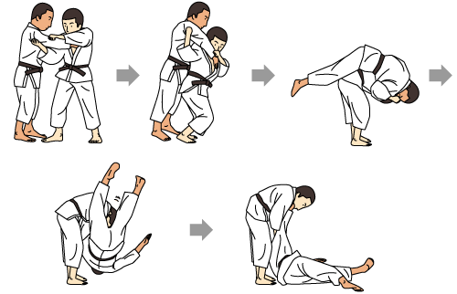

# Command Line Interface Ninja Skills

### Learn it, know it, live it


### History?  What did that ever teach us?


```
$ history  # What just happened?
```

### Hitting the Pipe


```
$ history | yeah_buddy
```

### Gnu Regular Expression Parser (a.k.a. "grep")

[GNU](https://en.wikipedia.org/wiki/GNU)

```
$ history | grep "sfdx"
```

### grep - for the win


```
$ grep -win "My_Custom_Field__c" *.cls
```

### Redirect


```
$ history |grep "sfdx" > wicked_commands.sh
```

### Shhhhh-mod?  Or Change Mode (with Transformer sound here)


```
chmod +x wicked_commands.sh
```

### PATH
#### The PATH of the rightous man, ...


```
export "PATH=${PATH}:/users/yournamehere/bin"
```

### Alias - Allow myself to introduce, ... myself

```
alias gpom="git push origin master"
```


